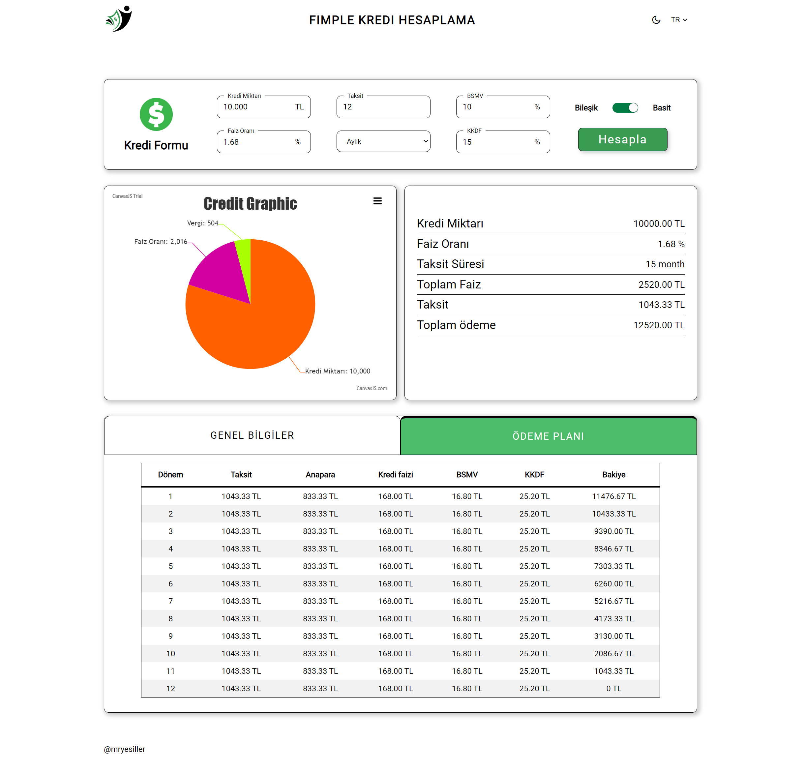
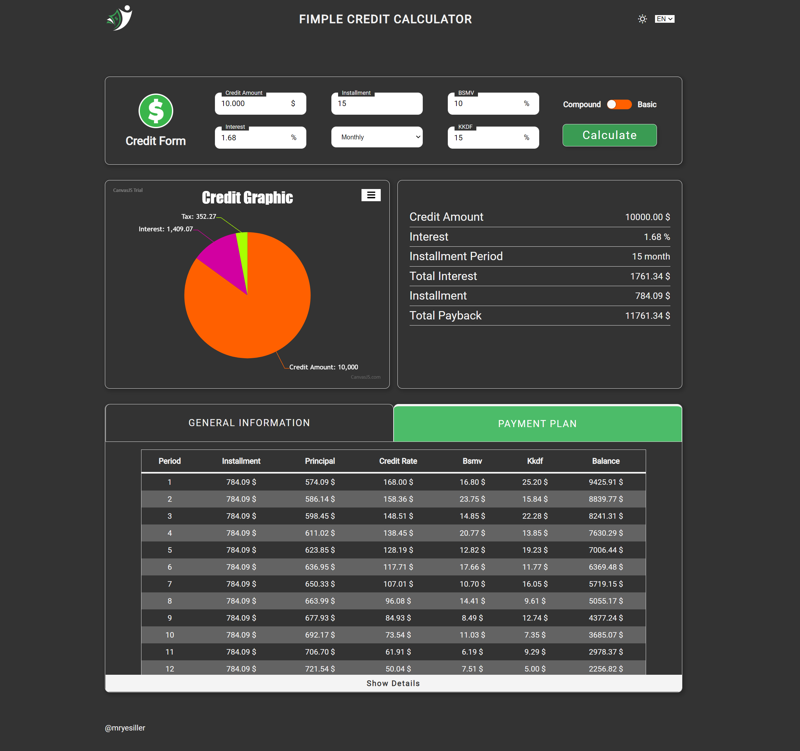
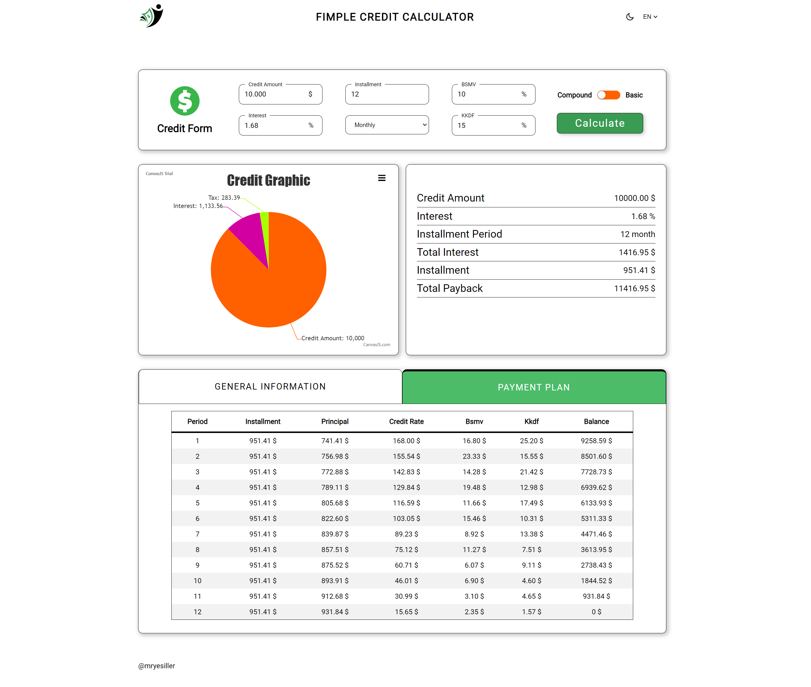
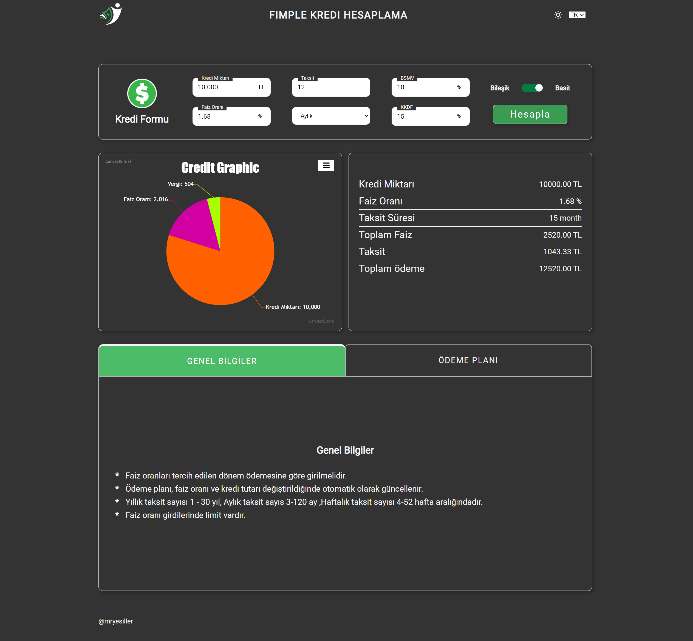

<h2 align="center">🏆 PATIKA FIMPLE REACT PRACTICUM PROJECT 🏆</h2>

 

<h2 align="center">🧱 ABOUT PROJECT 🧱</h2>

 

- This project is a bootcamp program prepared by [Fimple](https://fimple.co.uk/) on application development via [Patika.dev](https://www.patika.dev/)
- Final Case is Calculation of the repayment schedule in order to repay the loan payments in a certain structure.

 
 
<h2 align="center">📚 LIBRARIES 📚</h2>

 

<ul>
    <li>
        <a href="https://github.com/pmndrs/zustand" target="blank" title="zustand" >📀 zustand --> Context Library </a>
    </li>
     <li>
        <a href="https://www.npmjs.com/package/yup" target="blank" title="zustand" >📀 yup --> Validate Library</a>
    </li>
     <li>
        <a href="https://reactrouter.com/en/main" target="blank" title="zustand" >📀 react-router-dom --> Routes  </</a>
    </li>
     <li>
        <a href="https://github.com/sass/node-sass" target="blank" title="zustand" >📀 node-sass --> scss reprocessor</a>
    </li>
     <li>
        <a href="https://react.i18next.com/" target="blank" title="zustand" >📀 i18next / react-i18next --> Language management</a>
    </li>
     <li>
        <a href="https://gdowens.github.io/react-toggle-button/" target="blank" title="zustand" >📀 react-toggle-button --> Toggle button for form</a>
    </li>
     <li>
        <a href="https://www.davidhu.io/react-spinners/" target="blank" title="zustand" >📀 react-spinners --> Spinner for loading state</a>
    </li>
<ul/>

 
 
<h2 align="center">🔎 PROJECT OVERVIEW 🔎</h2>

 

<h3 align="left">General Info</h3>

The user should be able to make the following entries

- Credit amount
- Credit period
- Credit Rate
- Credit Period Type (monthly-weekly-yearly)
- Taxes (BSMV,KKDF)

Goal

- Taking the above information from the user as input in a form
- Calculation using the compound and simple profit formula
- Display of the repayment schedule in a table
- Making a static website using the React.js library

Project Details

- Sass is used for css edits.
- It is designed as a single page application.
- A layout has been created for the skeleton. The <'outlet'> feature from the react-router-dom library is used for other pages that can be added to the project in the future.
- Functions for validate and formatting are stored in helper folder.
- Simple and compound interest calculations done in the context folder.
- Options are presented to change language and light mode according to user preference.
- Context states have been created for light mode and language preferences.
- The context structure consists of two parts, one for events and one for calculations in the website.
- Micro components were created for repeated sections.
- Header and footer sections added to main site template.
- A loading component has been created for the loading times of the functions.
- An error page has been created for non-content link clicks by the user in the website name tab.
- Different methods such as reduce were used to increase reusability and avoid confusion.
- In the section where credit information is shown, color change is provided in the tabs by using useImperativeHandle.

 
<h3 align="left">Features</h3>

- The user can make all the entries given in the general information.
- User can calculate by selecting compound or simple interest option.
- User can see calculation result as graph and information page.
- User can see payback table.
- User can switch web page to day-night mode.
- The user can choose between two different language options, English and Turkish.
- The user can use the website responsively on any device.
- While calculating, the user waits on the loading screen.
- Errors are shown to the user in the part where he/she made an error.
- In case of clicking on a different address, a 404 not found page is shown to the user.
- The user can change the colors of the tabs by clicking on the desired tab in the section where the credit information is displayed.

 
<h3 align="left">Restricts</h3>

- User can select min 4 max 52 week period number for weekly period.
- User can choose min 0.01% max 5% credit rate for weekly period.
- The user can choose the minimum 500 max 100.000 unit credit amount for the weekly period.
- User can select min 3 max 120 month period number for monthly period.
- User can select min 0.01% max 15% credit rate for monthly period.
- User can select min 1.000 max 1.000.000 unit credit amount for the monthly period.
- User can select min 1 max 30 year period number for yearly period.
- User can select min 0.1% max 50% credit rate for yearly period.
- User can select min 10.000 max 10.000.000 unit credit amount for the yearly period.
- User cannot leave login information blank.

 
<h3 align="left">Deployment</h3>

This project was bootstrapped with [Create React App](https://github.com/facebook/create-react-app).

Development Mode:

    npm install --save
    npm start

 
<h2 align="center">📽️ PROJECT PICTURES 📽️</h2>

 

